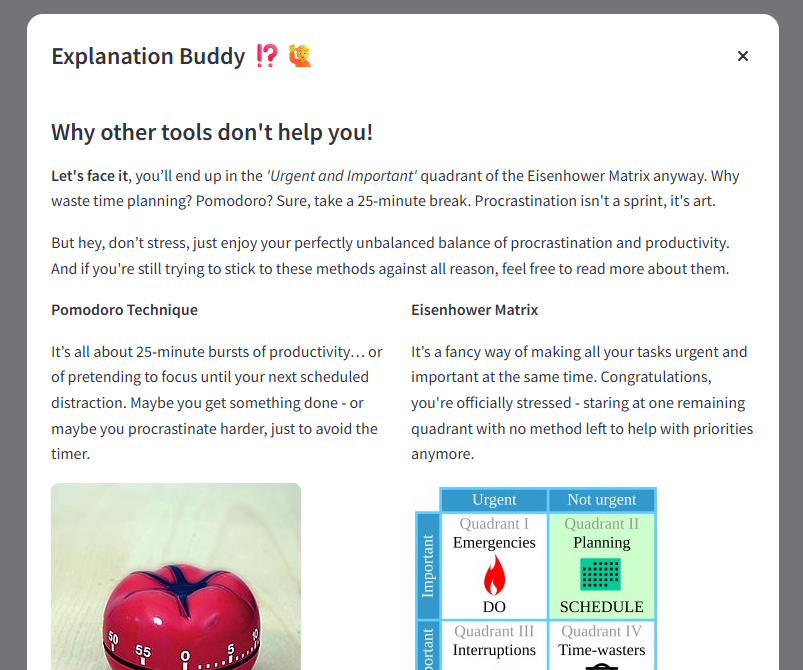
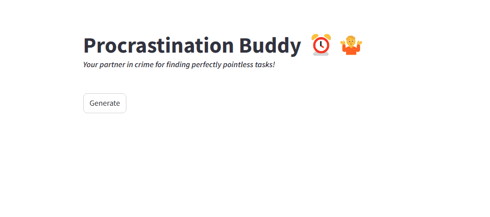
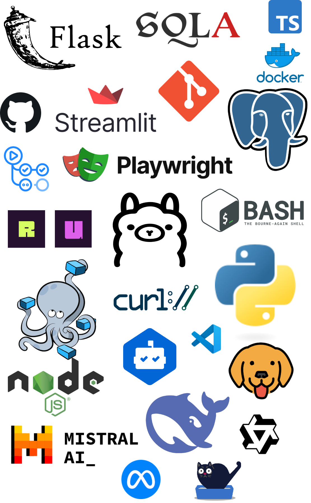

# Procrastination Buddy

## Overview

Procrastination Buddy is an amusing, yet functional app designed to help you find perfectly pointless tasks to put off important work. It serves as a companion when you're looking for something to do but want to avoid the real task at hand. 

**Unlike all the other apps that try to make you stop procrastinating, this one fully embraces it!** Finally, an app that doesn’t nag you to "get back on track" but instead encourages you to take a break with silly, fun tasks that keep you away from your to-do list. Whether you’re a master procrastinator or just need a break, this app offers a generation of distractions to keep you happily off-task.

## How It Looks

<p align="center">
  <a href="docs/frontend-light.png">
    
  </a>
  <a href="docs/frontend-dark.png">
    
  </a>
  <a href="docs/settings-light.png">
    
  </a>
  <a href="docs/help-light-partial.png">
    
  </a>
</p>



## Getting Started

To begin, ensure that you have **Docker** and **Docker Compose** installed (or use **Docker Desktop**, which includes both), as well as a **bash** shell. On Windows, good options for a bash shell include `git-bash` or `msys`.

The main entry point for the project is the `./buddy.sh` script. Where you can simply start with `./buddy.sh start`.

```bash
Usage: ./buddy.sh <command>

Commands:
  start   Start the services, install models, and wait until everything is ready
  stop    Stop all running services
  test    Run all tests (API and E2E)
```

When everything is set up, head over to [http://localhost:8501](http://localhost:8501) in your browser (like Chrome or Firefox) and start generating tasks!

__NOTE__: The time required to generate a task depends on your computer's hardware. In general, the smaller (and faster) models perform best with the English language.

## Technology Map



The app is built using Docker and Docker Compose to containerize and orchestrate a few key services:

- A **frontend** powered by **Streamlit** that displays procrastination tasks.
- A **backend** built with **Flask** that interacts with the task generation model.
- An **Ollama service** that runs an AI model responsible for generating the tasks.
- A **PostgreSQL** Database for storing settings and tasks.

## Contributing

I welcome contributions! Feel free to fork the repository and open a pull request, whether it’s for new features, bug fixes, or UI improvements.

## License

This project is licensed under the MIT License - see the [LICENSE](LICENSE) file for details.

---

**Enjoy procrastinating!**
