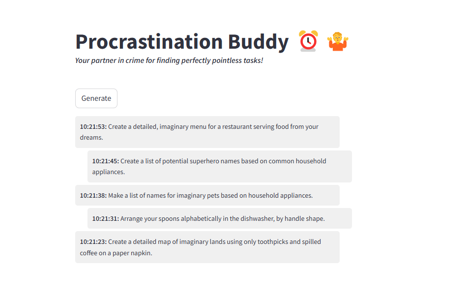
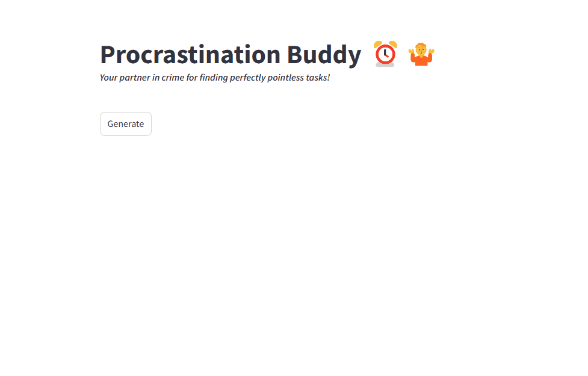

# Procrastination Buddy

## Overview

Procrastination Buddy is an amusing, yet functional app designed to help you find perfectly pointless tasks to put off important work. It serves as a companion when you're looking for something to do but want to avoid the real task at hand. 

**Unlike all the other apps that try to make you stop procrastinating, this one fully embraces it!** Finally, an app that doesn’t nag you to "get back on track" but instead encourages you to take a break with silly, fun tasks that keep you away from your to-do list. Whether you’re a master procrastinator or just need a break, this app offers a list of distractions to keep you happily off-task.

It looks like this:



Of course it can generate multiple requests and works in dark mode:



The app is built using Docker to containerize and orchestrate a few key services:

- A **frontend** powered by **Streamlit** that displays procrastination tasks.
- A **backend** built with **Flask** that interacts with the task generation model.
- An **Ollama service** that runs an AI model responsible for generating the tasks.

## Setup and Installation

To get started, make sure you have **Docker** and **Docker Compose** (or Docker-Desktop to get both bundled) installed on your system.

1. Clone this repository:
2. Build and start the services with Docker Compose:
   ```bash
   docker-compose up --build
   ```
3. Once the services are up, navigate to `http://localhost:8501` in your browser to start generating tasks!

__NOTE__: Please note that the time it takes to generate a task depends on your computer's hardware.

## Future Ideas

* Store Favorites
  * to look them up later
  * to influence the task generation
* share task ideas with your social media friends

## Contributing

Feel free to fork the repository and submit pull requests. Whether it’s adding new features, fixing bugs, or improving the UI, contributions are welcome!

## License

This project is licensed under the MIT License - see the [LICENSE](LICENSE) file for details.

---

**Enjoy procrastinating!**
